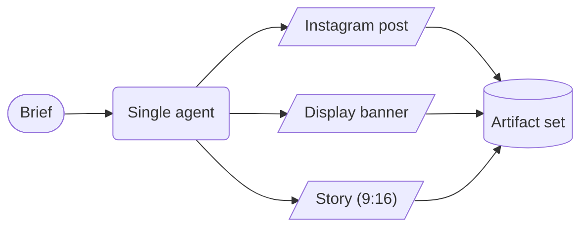
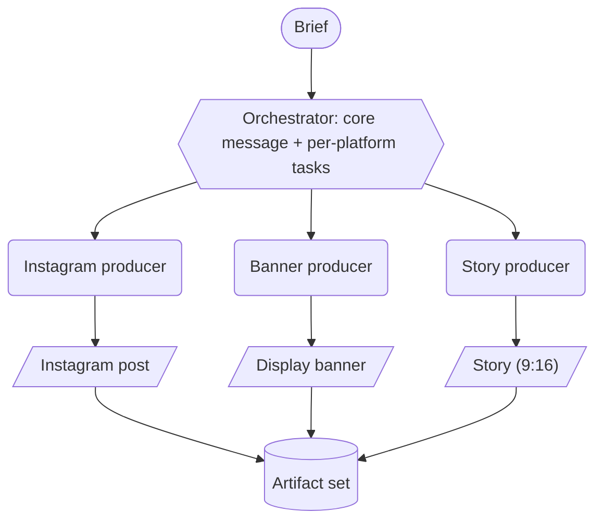
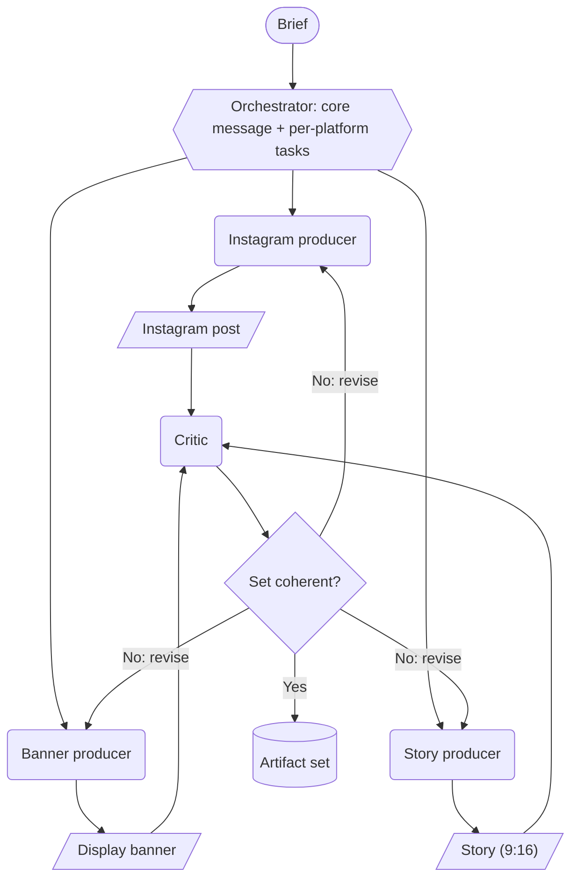

# Task & Topologies

## Task
- **Artifact**: one platform's deliverable (text + image), e.g. an Instagram post = image + caption + hashtags.
- **Artifact set**: all platform deliverables of one campaign together (Instagram post + vertical story + display banner); they must cohere.
- The system turns one **brief** into the whole **set**.
- Quality means coherence across the set (same message, brand, tone over the platforms), plus each artifact's own text-image fit.
- The idea generalises to personalised ads or game assets (thesis motivation).

## Assumptions
- Input = a marketing brief; user = someone who wants a coherent campaign across several platforms; output = the artifact set.
- The setup is chosen so that the RQ is answerable (granularity vs set coherence vs cost), not to copy a specific production workflow. Where it differs from real user requirements, that is a stated scope limitation.
- Platforms (the set): Instagram post, vertical story/Reel key visual, display banner (specs in Run Anatomy). All are Henkel-real channels and each combines text and image.

## Scope (which granularity we study)
- The granularity we vary is how finely the set-production process is split into coordinating roles: one agent, then orchestrator plus producers, then plus a critic. The per-artifact split stays fixed (one agent each), so the manipulated variable is the set-level coordination structure (Monolithic, Coarse, Fine), not the inside of one artifact.
- Why one agent per artifact stays fixed: for a task this shallow (one ad image), splitting a single artifact by modality (a separate copywriter and image agent) likely adds coordination cost without a quality gain (Tang: MAS helps mainly on deep tasks; Kim: coordination's gains diminish once a single agent already handles the task well, the capability-saturation effect). We additionally assume that one shared context for text and image helps their alignment. Both are scoping assumptions, not measured results.
- Future work: a single artifact's internal granularity; personalised one-to-many sets (target audience is already a brief field, held fixed here, so varying it per segment is the next step); and animating the static key visuals (a production add-on via richer producer skills, so the granularity findings still apply).

## Roles
- Orchestrator: turns the brief into the shared core message and the per-platform tasks. The core message is the system's internal tool for holding the set together; the evaluation never sees it and judges only the finished set against the brief (Metrics).
- Producer (one per platform): receives the full brief, the core message, and its platform task, and makes that platform's artifact, fitted to its format. Producers get the full brief in every topology, so splitting removes exactly one thing: the sight of the other producers' work, not brief information.
- Critic (Fine only): checks the whole set for cross-platform coherence and sends artifacts that drifted from the shared message back for revision.
  - The loop length follows a stopping rule rather than a fixed count: the loop stops when the critic accepts, or when a round's gain on the in-loop proxy falls below a threshold set in a pilot run. A hard cap (about 5) is only a cost limit, intended to be high enough to record the full gain-per-round curve; the pilot checks that the gains flatten before the cap.
  - Fine delivers the version it stopped on, like the other topologies deliver their one version. No best-of selection over the rounds: that would give Fine an advantage that comes from picking among versions, not from the revision mechanism the study tests. What selection would have added is visible in the round curve (Analysis).
  - Validity caution: the in-loop stopping signal must not be the same judge used for the reported set-coherence score, or the loop optimises the very score it is evaluated on. Use the critic's accept plus a separate lightweight in-loop proxy for stopping; keep the official judge for final scoring only.
  - *Open: what the in-loop proxy concretely is. Chosen in the implementation phase; it must stay separate from the official judge.*
  - Grounding: most of the gain comes in the first rounds, then it saturates (Self-Refine 2023); intrinsic self-correction without a ground-truth signal can degrade output (Huang 2024); whether that happens here is visible in the round curve (Analysis). The critic being a separate agent weakens Huang's argument but does not remove it (still an LLM, not ground truth).

## Topologies

Each producer makes one platform's artifact. The three topologies differ in one thing: where set coherence comes from. That is what the study isolates: what splitting does to whatever coherence a single shared context provides on its own.

| Topology | Where coherence comes from | Trade-off |
|---|---|---|
| Monolithic | One shared context: the whole set is written in a single context window, with no handoff between separate contexts where coherence could be lost | No specialisation or parallelism, and one context window does not scale |
| Coarse | Set up front: the orchestrator fixes one core message, then producers work in parallel with no contact (no feedback) | Each producer interprets that shared message on its own, so interpretations can diverge with no channel to reconcile them, and set-level drift is never corrected |
| Fine | Up front plus correction: a critic sees the whole set and sends drifting artifacts back to revise (closed loop) | Can correct drift, but costs revision rounds (communication tax, latency) |

So the axis is about when the coherence mechanism acts: never, because one shared context needs none (Monolithic); once, before the producers start (Coarse: the fixed core message); before and after (Fine: the core message plus the critic's correction loop). The research question is whether splitting loses coherence and how much, whether the explicit mechanisms restore it, at what cost, and which topology fits which use case, given the trade-off between set coherence, per-artifact quality, and cost.

Each topology is an established pattern: Monolithic is the single-agent baseline that MAS studies compare against (Tang 2025, Kim 2025). Coarse is the orchestrator-workers workflow (a central LLM breaks the task down and delegates to workers; Anthropic 2024), a centralised communication structure in Guo 2024's survey taxonomy: agents connect through one central node, with no producer-to-producer channel. Fine adds the evaluator-optimizer loop (one LLM generates, another evaluates and feeds back; Anthropic 2024); a separate critic that reviews output and gives feedback is a standard agent role in AutoGen's applications (Wu 2024).

**Monolithic**

**Coarse**: the orchestrator dispatches one producer per platform, in parallel, with no contact between them.

**Fine**: a critic checks the whole set for cross-platform coherence and sends artifacts back to revise.

Fine adds the critic and revision loop to Coarse: more messages and more revision work (how the tax share changes is an open measurement, see Metrics).

## Fair comparison
- The same prompt per role in every topology: each producer's instructions are identical in Coarse and Fine; Monolithic gets them combined, not a weaker hand-written prompt.
- Only what must differ per topology differs: the tools an agent has, and the wiring (who talks to whom, the loop). That difference is the granularity.
- Same model and brief; within a rep the seed is matched across topologies, so no topology gets a more favourable sample (it is varied across reps to sample variance; see Run Anatomy, Test matrix). No topology is tuned more than another.
