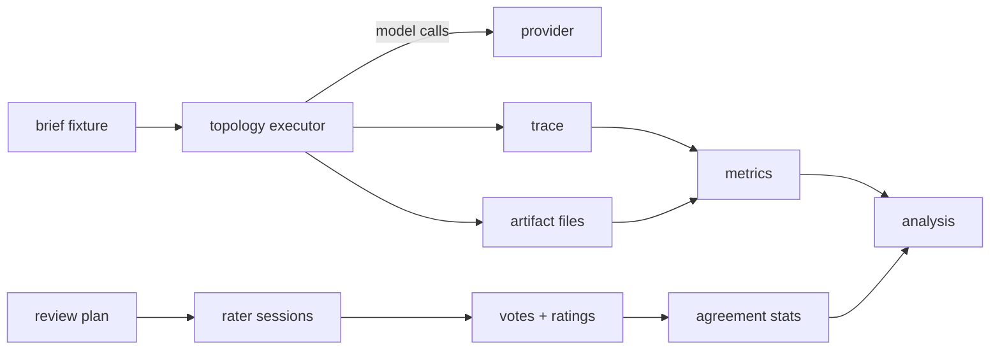
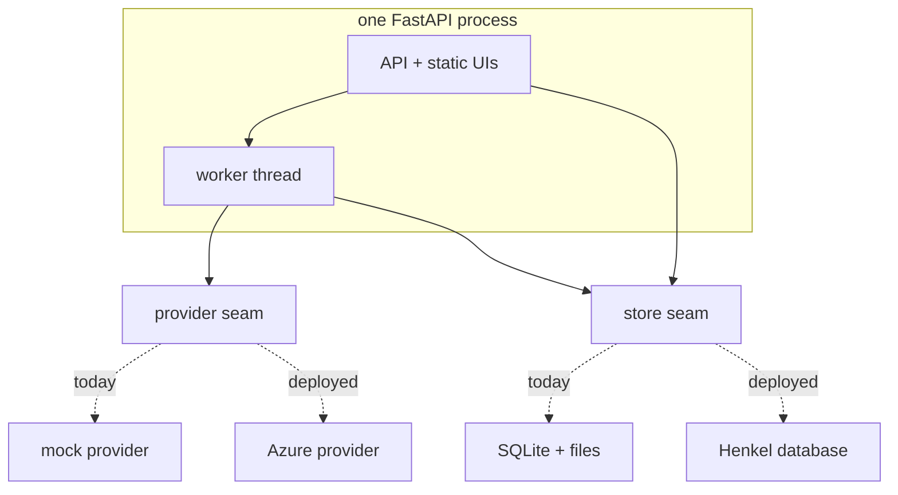

# Architecture

One Python package (`grain`), one FastAPI process, one SQLite database,
artifacts as files on disk. No queue, no ORM, no build step. Two halves live in
that process: the **harness** (execute runs, record traces, compute metrics)
and the **evaluation platform** (human review, analysis, the two UIs).

## Run pipeline

- A **run** is one `(brief, topology, rep)` execution with a recorded seed. The
  executor walks the topology's fixed graph, logs every provider call into the
  trace (role, purpose, seed, tokens, duration, parent calls), and writes the
  artifact images to disk.
- **Metrics** are computed right after a run finishes and stored as rows;
  nothing is recomputed on page load.
- The **review plan** materialises the concept's A/B pairs and rubric
  assignments (between-topology pairs, within-topology controls, anchors,
  scrambles) into sets and sessions. Raters work through a session via a code
  and never see topology labels.
- **Analysis** aggregates stored metric rows and review results: per-topology
  distributions, per-step effect sizes, the Pareto view, the revision-round
  curve.

## Trace and latency

The trace is the run's telemetry: one record per provider call. Its timeline is
**virtual** — a call starts when the calls it depends on have finished, and its
duration places it on that timeline (`harness/trace.py`). Real providers report
measured durations; the mock reports simulated ones of plausible magnitude. The
timeline therefore reflects the topology's true structure (independent
producers overlap, revision rounds chain) regardless of host scheduling.

Latency is read off this timeline as the **critical path** over the call graph
— not harness wall clock, which would be meaningless for millisecond mock runs
and scheduling-dependent for real ones. Raw wall clock is recorded alongside as
a sanity check.

## Execution model

Run batches execute on a single background thread inside the API process, one
batch job at a time. Progress lives in job and run rows that the UI polls; the
queue itself is in memory. At startup, any run or job still marked
queued/running belonged to a dead process and is swept to `failed`
(`harness/jobs.py`). Everything seeded derives from the run seed
(`harness/seeds.py`), so a re-run with the same seed reproduces the run
byte-for-byte under the mock.

## Seams

Exactly two abstraction seams exist, because the Henkel deployment will swap
both. Everything else is direct function calls.

- **Provider** (`providers/`): every model call — text, image, VIEScore judge,
  coherence judge — goes through the `Provider` protocol (`providers/base.py`).
  Today only the mock implements it. A real provider is one new module plus one
  entry in `providers/registry.py`, selected via `GRAIN_PROVIDER`.
- **Store** (`store/`): plain SQL behind small functions. Porting to Henkel's
  database means porting this package only.

Topology executors are plain functions sharing the prompt definitions in
`topologies/prompts.py`; the concept's fair-comparison rules (same producer
prompt everywhere, no concept slot in Independent, Monolithic as the combined
single-call variant) live there and are pinned by tests.

## HTTP surface

FastAPI serves the API and both static UIs from one port. The interactive
OpenAPI pages are disabled; this table is the reference.

| Area | Endpoints | Gated |
|---|---|---|
| Console pages | `GET /` (researcher UI), `GET /review/?code=…` (rater UI), `GET /health` | no |
| Runs | `GET /api/briefs` · `GET /api/matrix` · `POST /api/runs` (202, starts a batch) · `GET /api/runs` · `GET/DELETE /api/runs/{id}` · `POST /api/runs/{id}/rerun` · `POST /api/runs/{id}/recompute` · `GET /api/artifacts/{run}/{platform}/{round}` · `GET /api/jobs` | yes |
| Review admin | `POST/GET/DELETE /api/review/plan` · `GET /api/review/sets` (+ set images) · `POST/GET /api/review/sessions` · `DELETE /api/review/sessions/{id}` · `GET /api/review/results` | yes |
| Rater session | `GET /api/review/session/{code}` · `POST …/vote` · `DELETE …/vote/{pair}` · `POST …/rating` · `GET …/image/…` · `GET …/brief-image/…` | never |
| Analysis | `GET /api/analysis/machine` · `GET /api/analysis/pareto` · `GET /api/analysis/rounds` | yes |

"Gated" applies only when `GRAIN_ADMIN_TOKEN` is set: a middleware then
requires the token (header `X-Admin-Token`, or a cookie for image tags) on
everything under `/api` except the rater-session endpoints. The console prompts
for the token once. This exists to protect blinding — raters and the
researcher share one host, and without the gate a rater could open the
researcher API and see topology labels.

## Storage

`GRAIN_DATA_DIR` (default `./data`, `/data` in the container) holds the SQLite
database and one directory of artifact files per run. The directory is the
whole persistent state: back it up by copying it, reset the system by deleting
it.

## Configuration

Read once at startup from environment variables (`grain/config.py`). No config
files.

| Variable | Default | Meaning |
|---|---|---|
| `GRAIN_DATA_DIR` | `./data` | SQLite + artifact files |
| `GRAIN_BRIEFS_DIR` | `./briefs` | Brief fixtures (YAML) |
| `GRAIN_PROVIDER` | `mock` | Provider registry key |
| `GRAIN_ADMIN_TOKEN` | unset | When set, gates researcher endpoints (see above). Set it before sending raters a link; unset is fine for local work. |

Port and host belong to the uvicorn command line / Dockerfile.

## Deployment

- **Dev**: `docker compose -f docker-compose.yml -f docker-compose.dev.yml up`
  — source mounted, auto-reload; the test suite runs in the same image.
- **Reference**: `docker compose up --build` — code baked into the image, as it
  would run deployed. The image installs tesseract (spec-compliance
  OCR) and DejaVu fonts (deterministic text rendering); Python 3.14.
- **Henkel** (planned): same image contract — env-only
  configuration, `/health`, one exposed port, no external assets at runtime.
  The A2A layer ([design](design.md)) mounts next to the existing routes.
